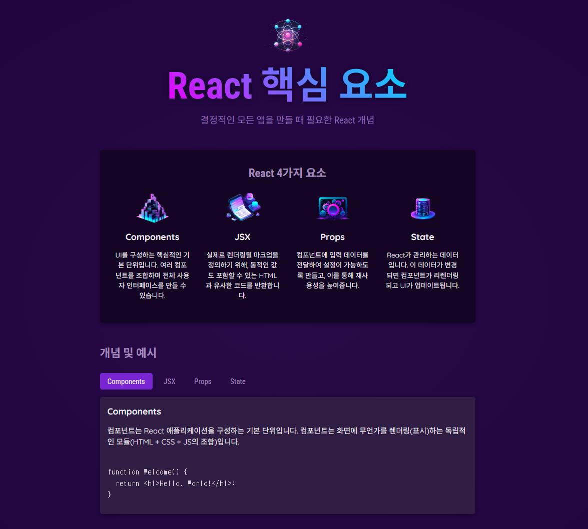

# 컴포넌트 핵심 개념 설명 사이트



## 🔑 React 4가지 핵심 개념

1. **Components**

   - UI를 구성하는 기본 단위입니다.
   - 여러 컴포넌트를 조합해 사용자 인터페이스를 만들 수 있습니다.
   - 예시:

   ```jsx
   function Welcome() {
     return <h1>Hello, World!</h1>;
   }
   ```

2. **JSX**

   - React에서 사용하는 JavaScript 확장 문법입니다.
   - HTML과 유사하지만 JavaScript 코드 안에서 UI 구조를 표현할 수 있습니다.
   - 예시:

   ```jsx
   <div>
     <h1>Welcome {userName}</h1>
     <p>Time to learn React!</p>
   </div>
   ```

3. **Props**

   - 컴포넌트에 데이터를 전달하는 방식입니다.
   - 부모 컴포넌트에서 자식 컴포넌트로 값 전달이 가능합니다.
   - 예시:

   ```jsx
   function Welcome(props) {
     return <h1>Hello, {props.name}</h1>;
   }
   ```

4. **State**

   - React 컴포넌트가 관리하는 동적인 데이터입니다.
   - 값이 변경되면 컴포넌트가 자동으로 다시 렌더링됩니다.
   - 예시:

   ```jsx
   function Counter() {
     const [isVisible, setIsVisible] = useState(false);

     function handleClick() {
       setIsVisible(true);
     }
     return (
       <div>
         <button onClick={handleClick}>Show Details</button>
         {isVisible && <p>Amazing details!</p>}
       </div>
     );
   }
   ```

## 📌 실습 목적

이 프로젝트는 React를 처음 배우는 사람도 핵심 개념을 빠르게 이해할 수 있도록  
**시각적인 설명 + 코드 예시**를 제공하는 것을 목표로 합니다.

## 🚀 실행 방법

```bash
# 설치
npm install

# 실행
npm run dev

```
