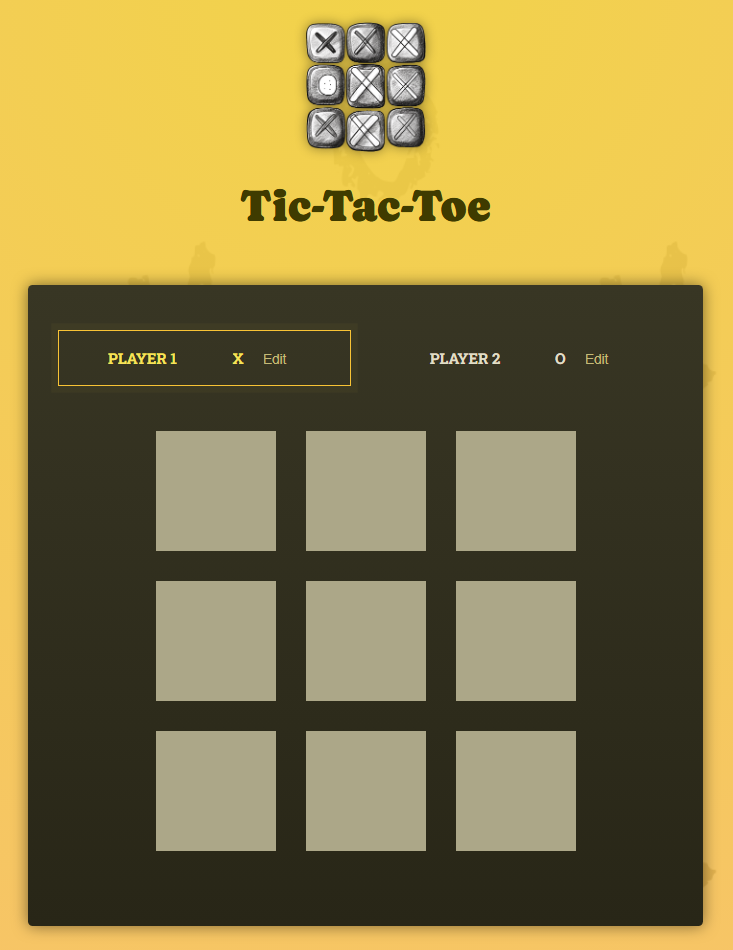

# 틱택톡 게임 사이트

플레이어 이름 설정, 턴 기록(Log), 승자 판별, 무승부 처리, 게임 재시작 기능을 포함하고 있습니다.

## 🚀 주요 기능

1. **플레이어 이름 설정**

   - 기본값: Player 1 (X), Player 2 (O)
   - 플레이어 이름을 직접 수정할 수 있음.

2. **게임 진행**

   - 3x3 보드에서 번갈아가며 X/O 표시
   - 현재 차례인 플레이어 하이라이트 표시

3. **승자 판별**

   - 미리 정의된 `WINNING_COMBINATIONS`를 기준으로 승자 계산
   - 승자가 결정되면 `GameOver` 컴포넌트에서 결과 표시

4. **무승부 처리**

   - 9번의 턴이 모두 끝났을 때 승자가 없으면 무승부

5. **게임 로그(Log)**

   - 각 턴마다 선택한 위치(row, col)와 플레이어 표시

6. **게임 재시작**
   - 게임이 끝난 후 다시 시작 가능

## 📂 프로젝트 구조

│ App.jsx # 메인 컴포넌트  
├─ components/ # 각 컴포넌트 폴더 모음  
&nbsp;&nbsp;├─ Player.jsx # 플레이어 이름 입력 & 표시  
&nbsp;&nbsp;├─ GameBoard.jsx # 3x3 게임 보드  
&nbsp;&nbsp;├─ Log.jsx # 턴 기록  
&nbsp;&nbsp;├─ GameOver.jsx # 게임 종료 화면(승리, 무승부)  
&nbsp;&nbsp;└─ winning-combinations.js # 승리 조건 정의
